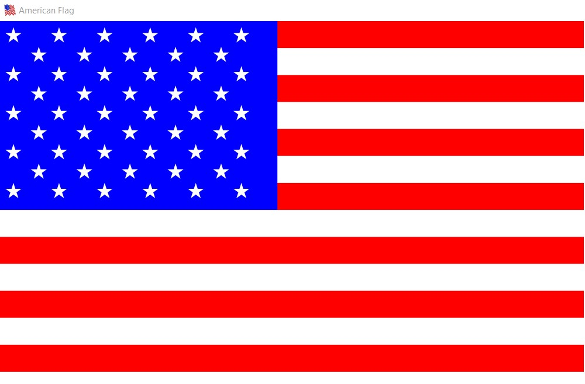

# American Flag JavaFX

 * Simple American Flag Graphic designed with basic geometry and horizontal animation created in JavaFX.
 * Horizontal animation on mouse press.
 * Pauses on mouse-dragging

 * Made on OpenJDK14.
 * Please download "javafx-sdk-11.0" and add all the jar-files in
 * Javafx-sdk-11.0.2\lib\ to the global library.
 * VM options --module-path [%java path%] --add-modules javafx.controls,javafx.fxml